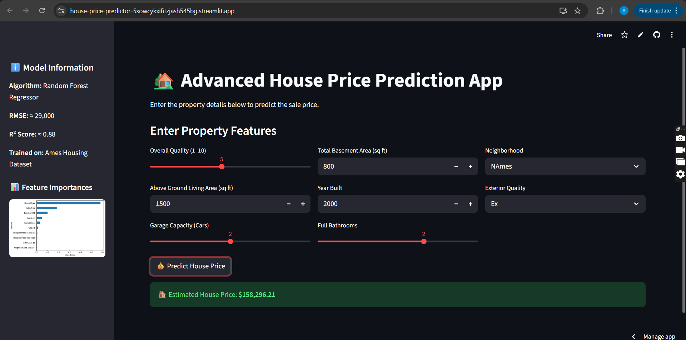

# 🏡 House Price Prediction App

This project predicts house sale prices based on property features such as overall quality, living area, year built, and neighborhood.  
Built using **Python, Scikit-Learn, and Streamlit**, it demonstrates a full end-to-end machine learning pipeline — from data preprocessing to model deployment.

---
## 🚀 Demo
[Live App on Streamlit Cloud](https://house-price-predictor-5sowcykxifitzjash545bg.streamlit.app/)

## 🧠 Model
- **Algorithm:** Tuned Random Forest Regressor  
- **R² Score:** ~0.89  
- **RMSE:** ~29,500  
- **Features:** Numeric + Categorical (Neighborhood, ExterQual)


## 🚀 Features
- Random Forest Regressor tuned with GridSearch
- Supports both numerical and categorical inputs
- User-friendly Streamlit web interface
- Real-time house price prediction
- Model and features saved with Joblib

---

## 🧠 Tech Stack
- **Python 3.x**
- **Streamlit** for web UI
- **Scikit-Learn** for ML
- **Pandas** and **NumPy** for data handling
- **Joblib** for model persistence

---

## Screenshot


## ⚙️ How to Run Locally

1. Clone the repo:
   ```bash
   https://github.com/Amith-kk/house-price-predictor
   cd house-price-predictor
